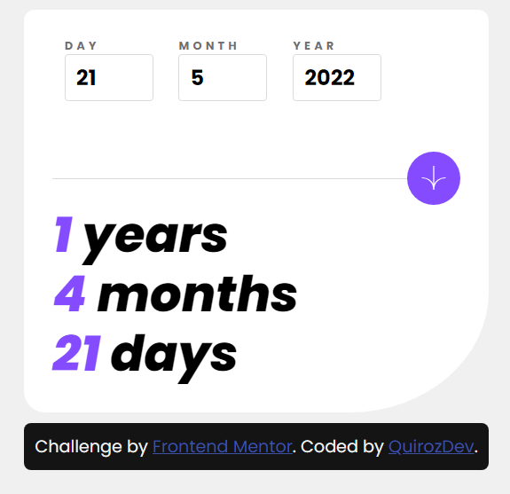

# Frontend Mentor - Age Calculator App

# Frontend Mentor - Age Calculator App

This is a solution to the [Age Calculator App challenge on Frontend Mentor](https://www.frontendmentor.io/challenges/age-calculator-app-dF9DFFpj-Q/hub).
This is a solution to the [Age Calculator App challenge on Frontend Mentor](https://www.frontendmentor.io/challenges/age-calculator-app-dF9DFFpj-Q/hub).

## Table of contents

- [Frontend Mentor - Age Calculator App solution](#frontend-mentor---age-calculator-app-solution)
  - [Table of contents](#table-of-contents)
  - [Overview](#overview)
    - [Screenshot](#screenshot)
    - [Links](#links)

## Overview

### Screenshot

### Links

- Solution URL: [Repository](https://github.com/Quirozdev/AgeCalculatorApp)
- Live Site URL: [Live Demo](https://quirozdev.github.io/AgeCalculatorApp/)
